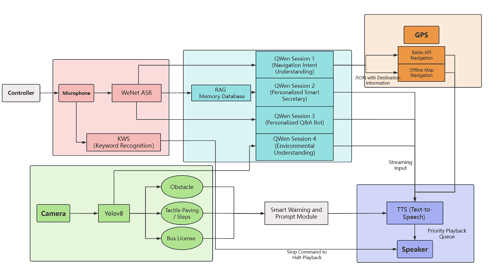
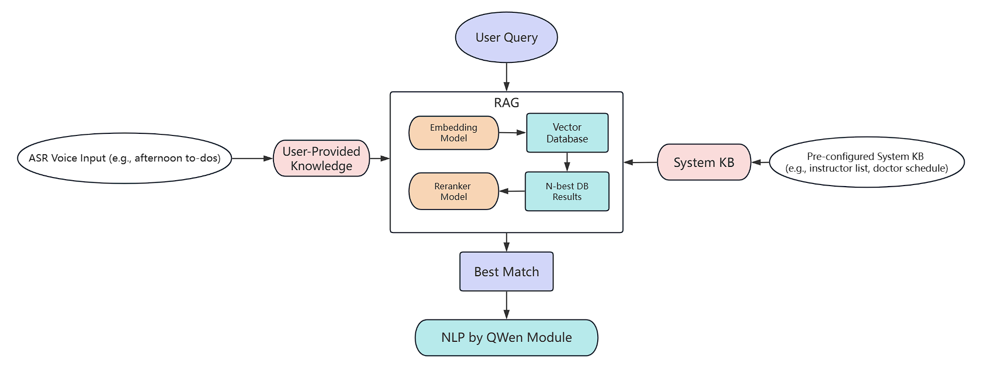

# AEGIS
### An Edge-AI Guided Inference System for Human-centric Navigation
This project is an AI-powered companion designed for individuals with visual impairments, offering comprehensive environmental perception, intelligent navigation, and personalized assistance. Built on the SOPHON BM1684X TPU, the system runs on the Radxa AirBox platform to create a powerful and efficient edge AI solution aimed at enhancing user mobility.
The project not only demonstrates a deployable assistive device but also serves as a research prototype for multi-modal, edge-based inference systems, highlighting challenges in model optimization, on-device personalization, and low-latency interaction.


---
### Key Features

1. **High-Precision Environment Perception**:
    * **Dynamic Visual Recognition**: Accurately identifies and announces key urban elements in real-time, such as bus route numbers, tactile paving, and crosswalks.
    * **Real-time Risk Warning**: Provides millisecond-level detection of obstacles, stairs, and other potential hazards, issuing high-priority voice alerts.
    * **Multi-dimensional Scene Understanding**: Offers rich descriptions of complex environments, including intersections, parks, and shopping malls.

2. **All-Scenario Intelligent Navigation**:
    * **Hybrid Path Planning**: Combines online map services with offline subway data to ensure seamless and reliable navigation coverage.
    * **Intent-Driven Interaction**: Understands the user's navigation and exploration intentions through natural language conversation.

3. **Personalized AI Assistant**:
    * **Generative Dialogue Engine**: Powered by a Large Language Model (LLM) to provide fluid, context-aware conversations, Q&A, and emotional support.
    * **RAG-Enhanced Memory**: Utilizes Retrieval-Augmented Generation (RAG) to build a private knowledge base, enabling it to remember personal information like "home address" or "daily schedule" for a truly personalized interactive experience.


### Main Work

Our primary work involved constructing a robust, multi-modal, cascaded **inference architecture** tailored for the SOPHON TPU edge platform. This was achieved by first converting a series of models—including **Qwen3-Reranker-0.6B, Qwen3-Embedding-0.6B, YOLOv8s-det**, and **YOLOv8s-seg** for TPU execution using the [tpu-mlir](https://github.com/sophgo/tpu-mlir) toolchain. We then integrated these with pre-existing models from the [Radxa-Model-Zoo](https://github.com/zifeng-radxa/Radxa-Model-Zoo), such as **WeNet, Qwen2.5-VL, VITS-CHINESE,** and **PP-OCR**, performing significant performance optimizations on them at the inference stage. Architecturally, the system is designed as a set of 10 decoupled **microservices** that communicate asynchronously via a **Redis** message bus, creating a powerful and replicable blueprint for complex AI applications on other edge devices.


#### Program Architecture


The system processes data through parallel pipelines for real-time assistance:

- **Voice & Vision Input**: The Microphone captures audio for KWS (wake word) and ASR (speech-to-text). Simultaneously, the Camera feeds a YOLOv8 model to detect obstacles, steps, and bus licenses.

- **Cognitive Processing**: A multi-session Qwen LLM acts as the core, handling navigation intent, personalized data via a RAG database, general Q&A, and environmental descriptions. Navigation commands use GPS with a hybrid of online and offline maps.

- **Audio Output**: A TTS engine converts all text responses to speech. A priority queue ensures critical warnings are played first through the Speaker.

The system is built on a fault-tolerant microservices architecture for high stability. For maximum performance, it employs a TPU-centric design where all core AI models are kept resident in memory. This approach eliminates common I/O bottlenecks on edge devices and ensures ultra-low latency.

##### code
This project is built on a modular, microservices-based architecture. Each core functionality is encapsulated in its own directory and runs as an independent service.

```
/
├── run.sh              # Main script to launch all services
├── ASR/                # Automatic Speech Recognition service (WeNet)
├── hardware/           # Manages hardware: microphone, speaker, gamepad
├── navigation/         # Handles hybrid online and offline navigation
├── qwen_vl/            # Cognitive core using the Qwen-VL model for reasoning
├── RAG/                # Retrieval-Augmented Generation for personalized memory
├── TTS/                # Text-to-Speech service for audio output
└── vision/             # Computer Vision service for real-time for each service
```

  * **`run.sh`**: The central launcher that starts all the microservices listed below.
  * **Services**: Each directory (`ASR`, `vision`, `TTS`, etc.) contains a self-contained service. This modular design allows for high fault tolerance and easier maintenance.
  * **`env/`**: This directory holds separate `requirements.txt` files for different services, confirming the decoupled nature of the architecture.

### Core Innovations

This project introduces several key innovations to optimize this assistive device with intelligent edge AI.

#### 1. RAG-based Personalization on the Edge


We implemented a two-stage retrieval process (embedding-based retrieval followed by a Reranker model) to create a dynamic, personalized memory for the AI assistant—a feature **rarely seen** in edge devices. We heavily optimized the models by reducing sequence length, applying **W4BF16 mixed-precision quantization**, and removing the **KV Cache**, significantly reducing memory footprint and latency while maintaining high accuracy.

#### 2. Unified Multi-Role Agent via a Single VL-LLM

Instead of a complex **multi-model** setup, we upgraded the architecture to a single, powerful **Vision-Language Large Model (Qwen2.5-VL)**. Through sophisticated **prompt engineering**, this unified "AI brain" seamlessly switches between different roles—a "navigator," a "personal secretary," or a "scene descriptor"—providing a highly integrated and intelligent user experience.

#### 3. Real-time, Streaming Voice Interaction

We designed a "generate-while-speaking" pipeline. The LLM's output is streamed **token-by-token**, intelligently segmented into sentences, and immediately sent to a parallelized **Text-to-Speech (TTS)** engine. This reduced the first-response latency from 7.68s to just 0.17s (a 44x improvement), enabling truly fluid conversation.

#### 4. Optimized Multi-Task Vision System

The vision module utilizes a custom-trained **YOLOv8** model for wide-spectrum, real-time object detection. The entire pipeline, from preprocessing to inference, is **hardware-accelerated** on the TPU and VPP. For specific tasks like bus number identification, we employ a two-step approach: YOLOv8 first locates the license plate, and then a lightweight **PP-OCR** model performs precise recognition on the cropped area, dramatically improving both speed and accuracy.

---
### Experimental Results

We conducted extensive benchmarking to evaluate the efficiency and scalability of our edge deployment.  
All experiments were carried out on the **SOPHON BM1684X TPU** under identical conditions.  

---

### Table 1: YOLOv8 Inference Performance

| Latency (ms) | Preprocess | Inference | Decode | Postprocess | Total Time | Ideal FPS |
| :----------- | :--------- | :-------- | :----- | :---------- | :--------- | :-------- |
| YOLOv8       | 3.34       | 9.52      | 2.06   | 1.57        | 16.49      | 60.6      |

> **Insight**: The optimized pipeline achieves \~60 FPS real-time inference, ensuring safe navigation in dynamic urban environments.

---

### Table 2: Speech Processing Model Performance

| Module                 | Inference Time (ms) | Memory Usage (MB) |
| :--------------------- | :------------------ | :---------------- |
| WeNet ASR              | 449.48              | 419               |
| VITS\_CHINESE TTS      | 119.75              | 364               |
| KWS (Keyword Spotting) | 260                 | --                |

> **Insight**: Despite limited edge resources, the system supports ASR + TTS + KWS simultaneously, enabling continuous real-time dialogue.

---

### Table 3: RAG Model Configuration Comparison

| Configuration                        | Avg. Latency (ms) | Memory Usage (MB) | Latency Δ | Memory Δ | Accuracy Score |
| :----------------------------------- | :---------------- | :---------------- | :-------- | :------- | :------------- |
| Final Design (Full Model)            | 126.4             | 539               | –         | –        | 0.989          |
| w/o W4BF16 Quantization (FP16)       | 109.7             | 1156              | -13.2%    | +114.5%  | 0.999          |
| w/o Sequence Reduction (Seq2048)     | 555.9             | 638               | +339.8%   | +99 MB   | 0.989          |
| w/o KV Cache Removal (Cache Enabled) | 140.8             | 628               | +11.4%    | +89 MB   | 0.989          |

> **Insight**: The proposed combination of quantization, sequence reduction, and KV cache removal yields the best latency–memory trade-off while preserving accuracy. This validates the feasibility of deploying personalized RAG on constrained edge hardware.

---


### Getting Started

This guide will walk you through the process of setting up and running the project on your local machine.

#### 1\. Prerequisites

Before you begin, ensure you have the following installed:

  * Python (3.8+ recommended)
  * Git
  * [Docker](https://www.docker.com/get-started) (Required for compiling custom models)

#### 2\. Clone the Repository

Clone the project repository to your local machine using the following command:

```bash
git clone https://github.com/renziang666/AEGIS-An-Edge-AI-Guided-Inference-System-for-Human-centric-Navigation
```

#### 3\. Set Up Python Environments

This project uses a microservices architecture, and the required Python packages for each service are listed in the `/env` directory. It is highly recommended to create separate virtual environments for each service to avoid package conflicts.

For each `requirements_*.txt` file in the `/env` directory, create an environment and install its dependencies.

*Example for the voice-related services:*

```bash
python -m venv venv_voice
source venv_voice/bin/activate
pip install -r env/requirements_voice.txt
```

#### 4\. Download and Prepare Models

This project requires several `.bmodel` files to run. You will need to download pre-trained models and compile the custom ones. We suggest creating a central `models/` directory in the project root to store all of them.

```bash
mkdir models
```

##### 4.1. Pre-trained Models

Download the following models from the [Radxa-Model-Zoo](https://github.com/zifeng-radxa/Radxa-Model-Zoo) and place the resulting `.bmodel` files into your `models/` directory:

  * WeNet
  * Qwen2.5-VL
  * VITS\_CHINESE
  * PP-OCR

##### 4.2. Custom Models (RAG & YOLO)

The RAG and YOLO models must be compiled from their base versions.

1.  **Download Base Models**:

      * Qwen3-Reranker-0.6B
      * Qwen3-Embedding-0.6B
      * YOLOv8s

2.  **Set Up `tpu_mlir` Compiler**:
    Pull the official Docker image which contains the necessary toolchain.

    ```bash
    docker pull sophgo/tpuc_dev:v3.3
    ```

3.  **Run Compilation Scripts**:
    Use the provided scripts located in the `/RAG/compile` and `/vision` directories to convert the base models into the `.bmodel` format. Move the final `.bmodel` files into your `models/` directory.

#### 5\. Configuration

After all `.bmodel` files are in your `models/` directory, you must update their paths within the project's scripts.

  * Review the service (`*_service.py`) and client (`*_clients.py`) scripts within each module (`/ASR`, `/vision`, etc.).
  * Locate the variables that define model paths and ensure they point to the correct file locations.

#### 6\. Run the Project

Once the environments are set up and all models are correctly configured, you can launch all services using the main script.

```bash
chmod +x run.sh
./run.sh
```

---

### Authors & Acknowledgements

This project was developed by:**Ziang Ren**, **Benhao Qin**, **Yunzhuo Yang**  
Special thanks to our advisor **Prof. Hai Li** for invaluable guidance and support.

---

### Citation

If you find this project useful in your research or applications, please cite it as:

```bibtex
@misc{AEGIS2025,
  title   = {AEGIS: An Edge-AI Guided Inference System for Human-centric Navigation},
  author  = {Ren, Ziang and Qin, Benhao and Yang, Yunzhuo},
  year    = {2025},
  note    = {GitHub repository},
  url     = {https://github.com/renziang666/AEGIS-An-Edge-AI-Guided-Inference-System-for-Human-centric-Navigation}
}
```
